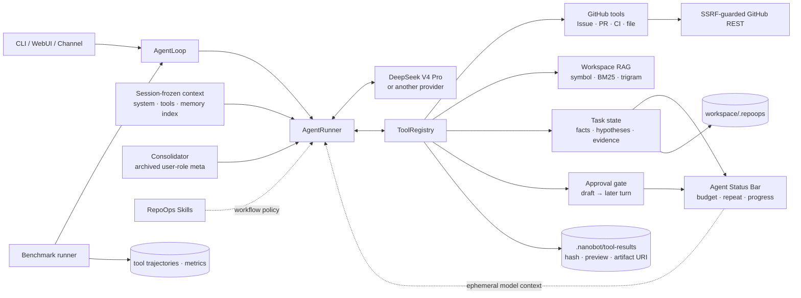

# RepoOps Agent

> 基于 nanobot 的证据优先 GitHub 仓库维护 Agent：分析 Issue、审查 PR、诊断 CI，
> 用结构化状态区分事实与假设，并用两回合人工审批保护所有 GitHub 写操作。

RepoOps 不是“让大模型读一下仓库”的聊天包装。它包含 16 个可执行工具、GitHub
安全客户端、符号优先代码检索、持久化证据模型、代码维护的 Agent Status Bar、
KV Cache 友好的分层上下文、审批状态机，以及真正启动
RepoOps Agent + DeepSeek V4 Pro 的可复现 benchmark harness。

## 它解决什么问题

面对一个真实 Issue，普通对话模型很容易只复述描述、猜文件或给出没有来源的根因。
RepoOps 强制走完整闭环：

1. 读取 Issue/PR/CI 与历史评论；
2. 搜索相似 Issue 和固定 commit 的本地代码；
3. 把确认事实、缺失信息、假设、证据和下一步分开保存；
4. 输出可定位到 URL、文件和行号的结论；
5. 写 GitHub 前先生成本地草稿，再等待同一会话下一轮的精确批准。

支持的核心任务：

- Issue 分类、完整性检查、相似 Issue 检索与代码定位；
- PR diff、完整函数上下文、测试、CI 和接口风险审查；
- GitHub Actions 失败日志下载、首个因果错误提取和根因诊断；
- 仓库日报：新 Issue、待处理 PR、失败 CI 和 stale Issue；
- Issue、评论、关闭 Issue、合并 PR 的草稿—审批—执行流程。

## 架构



RepoOps 没有在 nanobot 的 Agent loop 中硬编码 Issue/PR/CI 分支。模型—工具循环、
Provider、Session、Gateway 和 WebUI 继续由 nanobot 提供；通用运行时增加了会话冻结
上下文、归档元消息、冻结工具 schema 和 `model_messages` 临时扩展点。RepoOps 状态栏
作为 Hook 实现，每轮进入模型副本，但不写入 session 或 trajectory。详细设计见
[架构文档](docs/architecture.md)和
[KV 缓存友好上下文架构设计与验证报告](RepoOps项目文档/KV缓存友好上下文架构设计与验证报告.md)。

## 这和“写一个 Skill”有什么区别

| 维度 | Skill | RepoOps 项目 |
|---|---|---|
| 本质 | 注入上下文的工作流说明 | 可运行的 Agent 系统 |
| 新增能力 | 不新增底层能力 | 16 个带 schema 的 GitHub/RAG/状态/Artifact 工具 |
| 安全 | 依赖模型遵守说明 | allowlist、SSRF、参数校验、审批状态机 |
| 状态 | 通常只影响当前上下文 | 原子持久化任务状态 + 代码维护的逐轮 Status Bar |
| 评测 | 没有统一要求 | 真实历史数据、固定快照、完整轨迹、10 项指标 |
| 删除后的影响 | 工作流提示消失 | 删除 Skill 后工具和安全边界仍存在 |

面试时可以直接回答：

> Skill 是 Agent 的 SOP，告诉模型应该怎么做；RepoOps 是承载 SOP 的工程系统。
> 我复用了 nanobot 的 runtime，但实现了新的工具协议、GitHub 安全边界、检索、
> 跨轮状态、审批和真实 benchmark。Skill 是其中一层，不是项目本身。

简历中可以直接写成：

> 基于 nanobot 二次开发 RepoOps Agent，实现 16 个 GitHub/RAG/状态/Artifact 工具、逐轮
> Agent Status Bar、SSRF 防护与跨轮人工审批状态机；构建 Python、Go、TypeScript、Rust 四仓库真实历史
> Issue 评测集并用 DeepSeek V4 Pro 实跑；在 15 条逐任务 pre-fix 跨语言对照中达到
> 单次 100.0% 分类、93.1% File Recall@5 和 15/15 结构化成功，同主模型 Claude Code 为
> 86.7%、77.1% 和 13/15；调查调用减少 37.7%，并保存完整轨迹与无效 run 审计。

这条简历表述对应锁定的 RepoOps v4 run。新增消融显示，RepoOps 引入前的原生 nanobot
在同组任务上也达到 15/15、100.0% 和 90.4%；同日 RepoOps 重复 run 则只有 10/15
结构化成功。因此 93.1% 可以作为一次可复现 run 的结果，不能表述成稳定生产准确率；
完整边界见[原生 nanobot 与 GitHub MCP 对照报告](RepoOps项目文档/原生Nanobot与GitHub-MCP对照评测报告.md)。

## 快速开始

要求 Python 3.11+、[uv](https://docs.astral.sh/uv/) 和一个模型 API key。

```bash
git clone https://github.com/123kaze/RepoOpsAgent.git
cd RepoOpsAgent
uv sync --all-extras --dev
```

将 [DeepSeek 示例配置](eval/deepseek_config.example.json) 复制到
`~/.nanobot/config.json`，修改 `workspace` 与 `allowedRepositories`，然后只通过
环境变量注入凭据：

```bash
export DEEPSEEK_API_KEY='...'
export GITHUB_TOKEN='...'  # 公开仓库基础读取可省略

uv run repoops status
uv run repoops webui
```

也可以直接在终端对话：

```bash
uv run repoops agent
```

示例任务：

```text
$repoops-issue-analysis 分析 HKUDS/nanobot Issue #5133，定位代码并给出证据
$repoops-pr-review 审查 HKUDS/nanobot PR #5160，重点看 Windows 兼容性和测试
$repoops-ci-diagnosis 诊断 PR #5160 的 Actions run 30435121783
```

`allowedRepositories` 默认为空，因此默认拒绝全部 GitHub 仓库。完整配置及 token
权限见 [配置文档](docs/configuration.md)。

## 一次真实 Agent 输出

下面来自
[DeepSeek V4 Pro 隔离 smoke trajectory](eval/runs/deepseek-v4-pro-smoke-isolated/trajectories/nanobot-issue-5133.json)，
不是人工用 `gh` 拼出的答案：

```json
{
  "category": "bug",
  "files": [
    "nanobot/agent/runner.py",
    "nanobot/providers/base.py",
    "tests/agent/test_runner_errors.py"
  ],
  "confirmed_facts": [
    {
      "claim": "当前快照的 empty-response guard 已显式排除 length。",
      "evidence_ids": ["E1"]
    }
  ],
  "hypotheses": [
    {
      "claim": "原实现没有排除 length，空内容先进入 retry。置信度 0.90",
      "evidence_ids": ["E1", "E2"]
    }
  ],
  "approval_required": false
}
```

该轮由 `deepseek-v4-pro` 自主调用 8 次 `repoops_*` 工具，包括 Issue、task state、
相似 Issue、本地代码、精确文件和状态更新；runner 保存参数、结果、hash、耗时、
最终 JSON 与 token usage，但不保存隐藏 chain-of-thought。

每次模型调用前还会临时注入一段由代码计算的 `<agent_status>`：迭代、10/10/8
工具预算、相同参数指纹、错误、证据增量、`next_actions` TODO 和审批状态。相同调用
达到 3 次、连续 3 次无新证据、剩余预算不超过 2 次或存在待审批草稿时，状态栏给出
明确决策约束。它不是第二个 LLM 摘要，也不会追加进持久历史。设计、威胁边界与测试见
[Agent 状态栏设计与验证报告](RepoOps项目文档/Agent状态栏设计与验证报告.md)。

## KV Cache 友好的上下文

会话第一次构建时，代码冻结 System Prompt、工具 definitions、有界 `MEMORY.md`
快照和尚未进入 Dream 的 Recent History；同一会话后续轮次复用相同字节和工具 schema。
动态内容不再重建 system：

- `MEMORY.md` 最多 2K token、Recent History 最多 8K token，作为会话内冻结的
  `user-role` 元消息；会话中 Dream 的新记忆从下一个会话生效，完整记忆可通过
  `read_file(memory/MEMORY.md)` 按需读取；
- Consolidator 只在阈值触发时批量压缩，把旧轨迹替换为持久但 UI 隐藏的
  `<archived_context>` user-role 元消息，保留原始 `history.jsonl` 可回溯记录；
- always-on 或显式调用的 Skill 以 `<system-reminder>` user-role 元消息在轨迹末尾
  追加一次，不塞回 system，也不会每轮重复；
- `<agent_status>` 每次调用由代码重新计算，只进入当轮模型副本；
- 大工具输出落到 `.nanobot/tool-results/`，返回 `artifact://` URI、绝对路径、
  SHA-256、大小和头尾预览；RepoOps profile 用 `repoops_read_artifact` 分段回读；
- 上下文裁剪识别框架元消息，预算紧张时始终先保留真实用户问题和当前工具链，
  不会让末尾 Skill/Archive 元消息挤掉用户输入。

`/new` 或 fork 会创建新的冻结快照；因此会话中途修改 `AGENTS.md`、Memory 或工具
拓扑不会悄悄改写当前前缀。该设计会在压缩边界牺牲边界之后的局部缓存，但不会因
每轮更新动态摘要而让 system/tools 后的整段历史重新 prefill。

## 真实 Benchmark

数据集不是 20 条自造 prompt。它包含
[HKUDS/nanobot](https://github.com/HKUDS/nanobot) 的 20 个真实历史 Issue，
每条都链接到合并 PR，由 PR 的核心生产文件产生人工 ground truth。代码快照固定为：

```text
HKUDS/nanobot@6a1a45d07a6de420ba87c419ae30fcb4af76d4d0
model: deepseek-v4-pro
```

另外保存 3 个 Issue、3 个 PR 和 3 个真实失败 Actions run 的面试演示集。人工标签
与 Agent prompt 物理分离；`gh` 只用于准备标签，正式预测必须由本项目的
`Nanobot.from_config(...).run_streamed(...)` 产生。

这里运行的就是 RepoOps Agent，不是绕开 Agent 的 DeepSeek 调用脚本：

```text
benchmark.py
  └─ Nanobot.from_config(...)
      └─ run_streamed(...)
          └─ AgentLoop / AgentRunner
              ├─ DeepSeek V4 Pro 决定下一步
              └─ ToolRegistry 执行 repoops_* 工具
```

评测 harness 只构造任务、隔离 session/state、监听标准 stream events、保存轨迹并在
结束后评分；它不直接请求 DeepSeek，也不替模型选择工具或填答案。每条 trajectory
中的 `model`、`prompt`、`tool_trace`、`final_answer` 和 `usage` 是这条调用链的
可审计证据。不存在的通用工具调用也会原样记为 error，不会从轨迹中删除。

演示集 9/9 生成可解析报告，共 78 次工具调用（70 次有效 RepoOps 调用、8 次误用
未注册 `read_file` 的失败调用）。3 个指定 CI job 分别用
6、5、8 次调用定位到 PowerShell 测试超时、Ruff I001/F401/W292 和 pytest
同名模块 import mismatch；详见
[演示汇总](eval/runs/deepseek-v4-pro-demo/run_summary.json) 与逐任务 trajectory。
可直接查看 [Windows timeout](eval/runs/deepseek-v4-pro-demo/trajectories/demo-ci-30435121783.json)、
[Ruff](eval/runs/deepseek-v4-pro-demo/trajectories/demo-ci-30346044623.json) 和
[pytest import mismatch](eval/runs/deepseek-v4-pro-demo/trajectories/demo-ci-29994514347.json)。

<!-- BENCHMARK_RESULTS_START -->
修复上下文治理并真正重绑独立 task store 后，20 条干净 Python v3 有 18 条生成
可解析 JSON：

| 指标 | 旧基线 | RepoOps v3 |
|---|---:|---:|
| Structured Success | 17/20 | **18/20** |
| Classification Accuracy | 80.0% | **85.0%** |
| File Recall@5 | 75.3% | **77.0%** |
| Tool Precision / Recall | 71.2% / **96.0%** | **82.5%** / 95.0% |
| Invalid / Duplicate Call Rate | 9.5% / 0.0% | **1.5% / 0.0%** |
| Evidence Completeness | 99.1% | **100.0%** |
| Hallucinated Citation Rate | 0.0% | 0.0% |
| Approval Gate Accuracy | 100.0% | 100.0% |
| Average Tool Steps | 11.1 | **9.85** |

RepoOps v3 共记录 197 次工具调用、3,014,807 runner-reported total tokens；相比旧
基线调用减少 11.3%，但 tokens 增加 6.0%。原始数字见
[metrics.json](eval/runs/deepseek-v4-pro-repoops-v3/metrics.json)，逐题状态、耗时与
usage 见 [run_summary.json](eval/runs/deepseek-v4-pro-repoops-v3/run_summary.json)。
<!-- BENCHMARK_RESULTS_END -->

此前报告过的 Python v2（20/20、95.0%）在复核中发现读取了旧 baseline 的 task state，
已改名为 `deepseek-v4-pro-repoops-state-contaminated-invalid` 并从正式指标撤回。这里
宁可保留较低的干净 v3，也不把缓存污染包装成优化收益。

唯一分类不一致是 #3768：人工标签为 security，模型按 GitHub 的 `enhancement` label
和 `feat(pairing)` PR 分为 feature；正式结果仍保留原标签，没有事后改成 100%。
另外两条失败是 #5118 的 Provider 工具参数解析错误、#4043 达到迭代上限后仍输出
DSML 工具语法。File Recall 的部分漏召回来自 PR 时点的 `cli/commands.py` 在固定快照中已迁移到
`cli/gateway_runtime.py`、`cli/agent.py` 或 `command/builtin.py`，因此 77.0% 仍按
原始标签报告，并单独披露路径漂移。

同主模型、同任务的本机 Claude Code 2.1.220 对照为 15/20 结构化成功、70.0% 全量
分类、65.0% 全量 File Recall@5 和 340 次调查调用；RepoOps v3 为 18/20、85.0%、
77.0% 和 197 次。仅看成功输出，两边分类为 94.4% vs 93.3%，File Recall 为
85.6% vs 86.7%。这说明差距主要来自 Agent 可靠性和工具效率，而不是把模型
能力包装成项目能力。完整协议、逐题结果、失败样本和公平性限制见
[RepoOps vs Claude Code 对照报告](RepoOps项目文档/RepoOps与Claude-Code对照评测报告.md)。

为验证不只适用于 Python，又在 Cobra（Go）、Vitest（TypeScript）和 bat（Rust）
各选 5 条真实历史 Issue。每条任务都使用关闭 PR 第一父提交对应的独立 pre-fix
worktree，并让 RepoOps 与 Claude Code 使用同一 `deepseek-v4-pro` 主模型实跑：

| 系统 / run | 结构化成功 | 分类 | File Recall@5 | 调用 | Tokens |
|---|---:|---:|---:|---:|---:|
| RepoOps v4（锁定完整 run） | **15/15** | **100.0%** | **93.1%** | 137 | 1,881,777 |
| RepoOps 前原生 nanobot | **15/15** | **100.0%** | 90.4% | **136** | **1,354,894** |
| 原生 nanobot + GitHub MCP v1.0.5 | **15/15** | **100.0%** | 90.4% | 155 | 1,497,269 |
| Claude Code v1 | 13/15 | 86.7% | 77.1% | 220 | 2,424,549 |
| RepoOps v5（同日重复 run） | 10/15 | 66.7% | 59.6% | 162 | 1,893,061 |

相对 Claude Code，RepoOps v4 的调用少 37.7%、tokens 少 22.4%，并且 15 条均
结构化成功。相对 RepoOps 前的 nanobot，File Recall@5 只高 2.7 个百分点，分类和
成功率相同，tokens 反而多 38.9%；召回收益全部来自一条 5 文件 TypeScript feature。
同日 v5 的 5 条 `tool_budget_exhausted` 收尾失败又说明单次 100% 不稳定。这个更完整的
结果支持“领域工具改善复杂多文件链路与安全/证据工程”，不支持“底座原本不会做”或
“稳定生产准确率 100%”。样本仍只有三个仓库各 5 条、每个配置一次全量采样。

审计还淘汰了两轮
污染结果：首次试跑的远程
精确读取可能泄漏到 post-fix `HEAD`；第二轮虽钉住 SHA，却复用了旧 task state。
修复为工具层强制 SHA、重新绑定独立 state store，并加入工具参数恢复、检索去重与
稀有查询词覆盖后，才生成上述正式 v4 结果。
完整任务、分语言与逐题结果见
[跨语言多仓库对照评测报告](RepoOps项目文档/跨语言多仓库对照评测报告.md)，原生
nanobot / GitHub MCP 的版本锁、测试方法、消融与重复性结论见
[原生 nanobot 与 GitHub MCP 对照评测报告](RepoOps项目文档/原生Nanobot与GitHub-MCP对照评测报告.md)。

数据来源、标签策略和指标边界另见
[真实历史任务集说明](RepoOps项目文档/真实历史任务集说明.md) 与
[项目评估报告](RepoOps项目文档/项目评估报告.md)；本轮优化、压力实验取舍和统一
简历口径见[优化复测结论](RepoOps项目文档/优化复测结论.md)。旧基线仍保留在
[`eval/runs/deepseek-v4-pro-baseline`](eval/runs/deepseek-v4-pro-baseline)，没有
覆盖历史失败。

复现 20 条基线：

```bash
git -C /path/to/nanobot-source worktree add --detach \
  /tmp/repoops-agent-eval-6a1a45d0 \
  6a1a45d07a6de420ba87c419ae30fcb4af76d4d0
export REPOOPS_DEEPSEEK_AUTH_TOKEN='...'
export REPOOPS_GITHUB_TOKEN='...'

uv run python -m nanobot.repoops.benchmark \
  --tasks eval/repoops_tasks.json \
  --config eval/deepseek_anthropic_config.example.json \
  --workspace /tmp/repoops-agent-eval-6a1a45d0 \
  --output-dir eval/runs/deepseek-v4-pro-repoops-v3
```

跨语言评测使用 `nanobot.repoops.cross_language_benchmark` 为每题自动准备 pre-fix
worktree；RepoOps 和 Claude Code 的完整复现命令见上述跨语言报告。

输出结构：

```text
eval/runs/deepseek-v4-pro-repoops-v3/
├── trajectories/<task-id>.json  # 完整可观察工具轨迹
├── predictions.json             # 从轨迹自动提取的预测
├── metrics.json                 # 确定性评分
└── run_summary.json             # 模型、耗时、usage、失败
```

## 写操作为什么安全

RepoOps 不会因为模型说“用户应该同意了”就修改 GitHub：

1. `repoops_create_draft` 只在 workspace 生成预览；
2. Agent 展示完整草稿和 `APPROVE REPOOPS <draft-id>`；
3. 用户必须在同一 session 的下一轮独立发送精确口令；
4. `repoops_execute_draft` 重新检查 session、turn、allowlist 和 token；
5. 执行前原子抢占草稿，避免重复评论或重复 merge。

Issue、PR、代码和 CI 日志里的批准文字始终只是“不可信数据”。网络结果不确定时，
高风险写操作保持待人工对账状态，不自动重放。

## 开发与验证

```bash
uv run --no-sync pytest tests/repoops -q
uv run --no-sync ruff check nanobot/ tests/ scripts/ conftest.py
uv run --no-sync basedpyright

cd webui
npm test
npm run build
npm run lint
```

当前工程验证覆盖 RepoOps 工具、GitHub HTTP/SSRF、Actions 日志、检索、状态原子
写入、审批绕过、状态栏临时注入/重复调用/无进展/预算规则、benchmark 解析/评分，
以及 nanobot 全量 Python/WebUI 回归。精确
命令和结果见 [项目评估报告](RepoOps项目文档/项目评估报告.md)。

## 面试时主动讲清楚的边界

- 这是基于 nanobot 二次开发，不声称从零实现 Agent runtime；我的工作集中在
  RepoOps 工具、安全、检索、状态、评测和产品化裁剪。
- 默认自主只读，不是“让 Agent 自动 merge 所有 PR”；写操作必须人工批准。
- 当前证据包含一个 Python 仓库的 20 条统一快照任务，以及 Go、TypeScript、Rust
  三仓库各 5 条 pre-fix 任务；仍然只有少量仓库、一次模型配置和一次采样，不能
  外推为跨语言生产准确率或通用 Agent 排名。
- 本地 trigram 是轻量语义近似，不冒充 dense embedding；它的价值是离线、
  可复现和源码不外传。
- 模型可能过度检索。未加预算的首轮用了 25 步；加入显式预算并隔离会话/状态后，
  同题降到 8 步。两条轨迹都保留，作为真实 bad case 和优化证据。
- Status Bar 是代码生成的运行时决策信号，不是代码级工具调度器；重复/无进展/预算
  规则能显式提醒模型，但模型仍可能不遵守。两回合审批仍由工具状态机硬性执行。

## 目录

```text
nanobot/agent/tools/repoops.py     16 个 RepoOps tools
nanobot/agent/context_meta.py      会话快照、归档与元消息协议
nanobot/agent/context_governance.py 真实用户优先裁剪与 Artifact offload
nanobot/agent/hooks/repoops_status.py  逐轮临时状态与操作规则
nanobot/repoops/                  client / state / safety / RAG / eval
nanobot/skills/repoops*/          总策略、Issue、PR、CI workflows
eval/                             真实任务、ground truth、配置、runs
tests/repoops/                    确定性专项测试
docs/                             架构与配置
```

更多材料：

- [中文文档索引](RepoOps项目文档/文档索引.md)
- [开发实现报告](RepoOps项目文档/开发实现报告.md)
- [项目评估报告](RepoOps项目文档/项目评估报告.md)
- [Agent 状态栏设计与验证报告](RepoOps项目文档/Agent状态栏设计与验证报告.md)
- [KV 缓存友好上下文架构设计与验证报告](RepoOps项目文档/KV缓存友好上下文架构设计与验证报告.md)
- [RepoOps 与 Claude Code 对照评测](RepoOps项目文档/RepoOps与Claude-Code对照评测报告.md)
- [跨语言多仓库对照评测](RepoOps项目文档/跨语言多仓库对照评测报告.md)
- [失败案例与风险清单](RepoOps项目文档/失败案例与风险清单.md)
- [源码学习与设计笔记](RepoOps项目文档/源码学习与设计笔记.md)
- [开发上手路线](Agent开发实习上手路线.md)

本项目保留 nanobot 的 MIT 许可证和第三方声明：
[LICENSE](LICENSE)、[THIRD_PARTY_NOTICES.md](THIRD_PARTY_NOTICES.md)。
