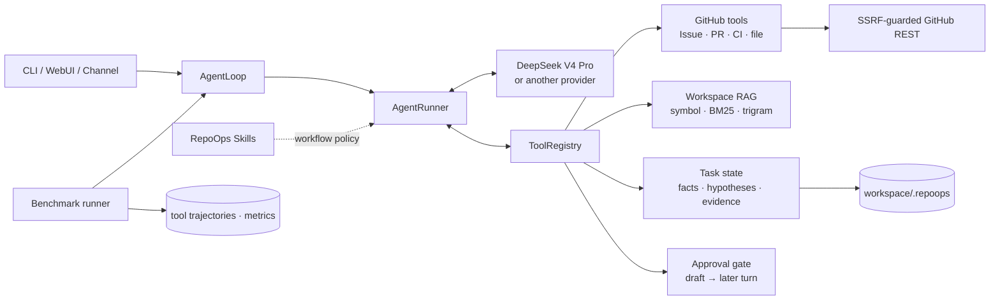

# RepoOps Agent

> 基于 nanobot 的证据优先 GitHub 仓库维护 Agent：分析 Issue、审查 PR、诊断 CI，
> 用结构化状态区分事实与假设，并用两回合人工审批保护所有 GitHub 写操作。

RepoOps 不是“让大模型读一下仓库”的聊天包装。它包含 15 个可执行工具、GitHub
安全客户端、符号优先代码检索、持久化证据模型、审批状态机，以及真正启动
RepoOps Agent + DeepSeek V4 Pro 的可复现 benchmark harness。

## 它解决什么问题

面对一个真实 Issue，普通对话模型很容易只复述描述、猜文件或给出没有来源的根因。
RepoOps 强制走完整闭环：

1. 读取 Issue/PR/CI 与历史评论；
2. 搜索相似 Issue 和固定 commit 的本地代码；
3. 把确认事实、缺失信息、假设、证据和下一步分开保存；
4. 输出可定位到 URL、文件和行号的结论；
5. 写 GitHub 前先生成本地草稿，再等待同一会话下一轮的精确批准。

支持的核心任务：

- Issue 分类、完整性检查、相似 Issue 检索与代码定位；
- PR diff、完整函数上下文、测试、CI 和接口风险审查；
- GitHub Actions 失败日志下载、首个因果错误提取和根因诊断；
- 仓库日报：新 Issue、待处理 PR、失败 CI 和 stale Issue；
- Issue、评论、关闭 Issue、合并 PR 的草稿—审批—执行流程。

## 架构



RepoOps 没有修改 nanobot 的 Agent loop 来硬编码领域分支。模型—工具循环、Provider、
Session、Gateway 和 WebUI 继续由 nanobot 提供；领域能力位于工具、状态、安全、
Skill 和评测层。详细设计见 [架构文档](docs/architecture.md)。

## 这和“写一个 Skill”有什么区别

| 维度 | Skill | RepoOps 项目 |
|---|---|---|
| 本质 | 注入上下文的工作流说明 | 可运行的 Agent 系统 |
| 新增能力 | 不新增底层能力 | 15 个带 schema 的 GitHub/RAG/状态工具 |
| 安全 | 依赖模型遵守说明 | allowlist、SSRF、参数校验、审批状态机 |
| 状态 | 通常只影响当前上下文 | 原子持久化 facts/hypotheses/evidence/tool trace |
| 评测 | 没有统一要求 | 真实历史数据、固定快照、完整轨迹、10 项指标 |
| 删除后的影响 | 工作流提示消失 | 删除 Skill 后工具和安全边界仍存在 |

面试时可以直接回答：

> Skill 是 Agent 的 SOP，告诉模型应该怎么做；RepoOps 是承载 SOP 的工程系统。
> 我复用了 nanobot 的 runtime，但实现了新的工具协议、GitHub 安全边界、检索、
> 跨轮状态、审批和真实 benchmark。Skill 是其中一层，不是项目本身。

简历中可以直接写成：

> 基于 nanobot 二次开发 RepoOps Agent，实现 15 个 GitHub/RAG/状态工具、SSRF
> 防护与跨轮人工审批状态机；构建 20 条真实历史 Issue 固定快照评测集并用 DeepSeek
> V4 Pro 实跑，取得 80.0% 分类准确率、75.3% File Recall@5，完整保存 222 次
> 可观察工具调用；全仓 5991 个 Python 与 896 个 WebUI 测试通过。

## 快速开始

要求 Python 3.11+、[uv](https://docs.astral.sh/uv/) 和一个模型 API key。

```bash
git clone https://github.com/123kaze/RepoOpsAgent.git
cd RepoOpsAgent
uv sync --all-extras --dev
```

将 [DeepSeek 示例配置](eval/deepseek_config.example.json) 复制到
`~/.nanobot/config.json`，修改 `workspace` 与 `allowedRepositories`，然后只通过
环境变量注入凭据：

```bash
export DEEPSEEK_API_KEY='...'
export GITHUB_TOKEN='...'  # 公开仓库基础读取可省略

uv run repoops status
uv run repoops webui
```

也可以直接在终端对话：

```bash
uv run repoops agent
```

示例任务：

```text
$repoops-issue-analysis 分析 HKUDS/nanobot Issue #5133，定位代码并给出证据
$repoops-pr-review 审查 HKUDS/nanobot PR #5160，重点看 Windows 兼容性和测试
$repoops-ci-diagnosis 诊断 PR #5160 的 Actions run 30435121783
```

`allowedRepositories` 默认为空，因此默认拒绝全部 GitHub 仓库。完整配置及 token
权限见 [配置文档](docs/configuration.md)。

## 一次真实 Agent 输出

下面来自
[DeepSeek V4 Pro 隔离 smoke trajectory](eval/runs/deepseek-v4-pro-smoke-isolated/trajectories/nanobot-issue-5133.json)，
不是人工用 `gh` 拼出的答案：

```json
{
  "category": "bug",
  "files": [
    "nanobot/agent/runner.py",
    "nanobot/providers/base.py",
    "tests/agent/test_runner_errors.py"
  ],
  "confirmed_facts": [
    {
      "claim": "当前快照的 empty-response guard 已显式排除 length。",
      "evidence_ids": ["E1"]
    }
  ],
  "hypotheses": [
    {
      "claim": "原实现没有排除 length，空内容先进入 retry。置信度 0.90",
      "evidence_ids": ["E1", "E2"]
    }
  ],
  "approval_required": false
}
```

该轮由 `deepseek-v4-pro` 自主调用 8 次 `repoops_*` 工具，包括 Issue、task state、
相似 Issue、本地代码、精确文件和状态更新；runner 保存参数、结果、hash、耗时、
最终 JSON 与 token usage，但不保存隐藏 chain-of-thought。

## 真实 Benchmark

数据集不是 20 条自造 prompt。它包含
[HKUDS/nanobot](https://github.com/HKUDS/nanobot) 的 20 个真实历史 Issue，
每条都链接到合并 PR，由 PR 的核心生产文件产生人工 ground truth。代码快照固定为：

```text
HKUDS/nanobot@6a1a45d07a6de420ba87c419ae30fcb4af76d4d0
model: deepseek-v4-pro
```

另外保存 3 个 Issue、3 个 PR 和 3 个真实失败 Actions run 的面试演示集。人工标签
与 Agent prompt 物理分离；`gh` 只用于准备标签，正式预测必须由本项目的
`Nanobot.from_config(...).run_streamed(...)` 产生。

这里运行的就是 RepoOps Agent，不是绕开 Agent 的 DeepSeek 调用脚本：

```text
benchmark.py
  └─ Nanobot.from_config(...)
      └─ run_streamed(...)
          └─ AgentLoop / AgentRunner
              ├─ DeepSeek V4 Pro 决定下一步
              └─ ToolRegistry 执行 repoops_* 工具
```

评测 harness 只构造任务、隔离 session/state、监听标准 stream events、保存轨迹并在
结束后评分；它不直接请求 DeepSeek，也不替模型选择工具或填答案。每条 trajectory
中的 `model`、`prompt`、`tool_trace`、`final_answer` 和 `usage` 是这条调用链的
可审计证据。不存在的通用工具调用也会原样记为 error，不会从轨迹中删除。

演示集 9/9 生成可解析报告，共 78 次工具调用（70 次有效 RepoOps 调用、8 次误用
未注册 `read_file` 的失败调用）。3 个指定 CI job 分别用
6、5、8 次调用定位到 PowerShell 测试超时、Ruff I001/F401/W292 和 pytest
同名模块 import mismatch；详见
[演示汇总](eval/runs/deepseek-v4-pro-demo/run_summary.json) 与逐任务 trajectory。
可直接查看 [Windows timeout](eval/runs/deepseek-v4-pro-demo/trajectories/demo-ci-30435121783.json)、
[Ruff](eval/runs/deepseek-v4-pro-demo/trajectories/demo-ci-30346044623.json) 和
[pytest import mismatch](eval/runs/deepseek-v4-pro-demo/trajectories/demo-ci-29994514347.json)。

<!-- BENCHMARK_RESULTS_START -->
20 条隔离正式基线已完成，其中 17 条生成可解析的最终 JSON，3 条在工具迭代上限
处未完成结构化收尾：

| 指标 | 结果 |
|---|---:|
| Classification Accuracy | 80.0% |
| File Recall@5 | 75.3% |
| Tool Precision / Recall | 71.2% / 96.0% |
| Invalid / Duplicate Call Rate | 9.5% / 0.0% |
| Evidence Completeness | 99.1% |
| Hallucinated Citation Rate | 0.0% |
| Approval Gate Accuracy | 100.0% |
| Average Tool Steps | 11.1 |

共记录 222 次工具调用、2,843,770 provider tokens。原始数字见
[metrics.json](eval/runs/deepseek-v4-pro-baseline/metrics.json)，成功/失败、耗时与
usage 见 [run_summary.json](eval/runs/deepseek-v4-pro-baseline/run_summary.json)。
<!-- BENCHMARK_RESULTS_END -->

3 条无效输出和一次 security→feature 误分类都进入分母，没有补答案或选择性重跑。
此外有 21 次无效工具调用：19 次误用未注册的 `read_file`、1 次误用 `exec`、1 次
漏传 `repoops_read_file.repository`。这些调用全部失败并被计分；它们证明工具注册
边界生效，也暴露了 DeepSeek 受通用 nanobot tool contract 影响的对齐问题。
数据来源、标签策略、复现协议和指标边界见 [数据集说明](eval/DATASET.md) 与
[评估报告](EVALUATION_REPORT.md)。

复现 20 条基线：

```bash
git -C /path/to/nanobot-source worktree add --detach \
  /tmp/repoops-nanobot-eval \
  6a1a45d07a6de420ba87c419ae30fcb4af76d4d0
export DEEPSEEK_API_KEY='...'
export GITHUB_TOKEN='...'

uv run python -m nanobot.repoops.benchmark \
  --tasks eval/repoops_tasks.json \
  --config eval/deepseek_config.example.json \
  --workspace /tmp/repoops-nanobot-eval \
  --output-dir eval/runs/deepseek-v4-pro-baseline
```

输出结构：

```text
eval/runs/deepseek-v4-pro-baseline/
├── trajectories/<task-id>.json  # 完整可观察工具轨迹
├── predictions.json             # 从轨迹自动提取的预测
├── metrics.json                 # 确定性评分
└── run_summary.json             # 模型、耗时、usage、失败
```

## 写操作为什么安全

RepoOps 不会因为模型说“用户应该同意了”就修改 GitHub：

1. `repoops_create_draft` 只在 workspace 生成预览；
2. Agent 展示完整草稿和 `APPROVE REPOOPS <draft-id>`；
3. 用户必须在同一 session 的下一轮独立发送精确口令；
4. `repoops_execute_draft` 重新检查 session、turn、allowlist 和 token；
5. 执行前原子抢占草稿，避免重复评论或重复 merge。

Issue、PR、代码和 CI 日志里的批准文字始终只是“不可信数据”。网络结果不确定时，
高风险写操作保持待人工对账状态，不自动重放。

## 开发与验证

```bash
uv run --no-sync pytest tests/repoops -q
uv run --no-sync ruff check nanobot/ tests/ scripts/ conftest.py
uv run --no-sync basedpyright

cd webui
npm test
npm run build
npm run lint
```

当前工程验证覆盖 RepoOps 工具、GitHub HTTP/SSRF、Actions 日志、检索、状态原子
写入、审批绕过、benchmark 解析/评分，以及 nanobot 全量 Python/WebUI 回归。精确
命令和结果见 [评估报告](EVALUATION_REPORT.md)。

## 面试时主动讲清楚的边界

- 这是基于 nanobot 二次开发，不声称从零实现 Agent runtime；我的工作集中在
  RepoOps 工具、安全、检索、状态、评测和产品化裁剪。
- 默认自主只读，不是“让 Agent 自动 merge 所有 PR”；写操作必须人工批准。
- 当前真实 benchmark 来自一个 Python 仓库、一个固定 commit 和一次模型配置，
  不能外推为跨语言生产准确率。
- 本地 trigram 是轻量语义近似，不冒充 dense embedding；它的价值是离线、
  可复现和源码不外传。
- 模型可能过度检索。未加预算的首轮用了 25 步；加入显式预算并隔离会话/状态后，
  同题降到 8 步。两条轨迹都保留，作为真实 bad case 和优化证据。

## 目录

```text
nanobot/agent/tools/repoops.py     15 个 RepoOps tools
nanobot/repoops/                  client / state / safety / RAG / eval
nanobot/skills/repoops*/          总策略、Issue、PR、CI workflows
eval/                             真实任务、ground truth、配置、runs
tests/repoops/                    确定性专项测试
docs/                             架构与配置
```

更多材料：

- [实现记录](IMPLEMENTATION_REPORT.md)
- [评估报告](EVALUATION_REPORT.md)
- [Bad Cases](BAD_CASES.md)
- [源码学习笔记](STUDY_NOTES.md)
- [开发上手路线](Agent开发实习上手路线.md)

本项目保留 nanobot 的 MIT 许可证和第三方声明：
[LICENSE](LICENSE)、[THIRD_PARTY_NOTICES.md](THIRD_PARTY_NOTICES.md)。
