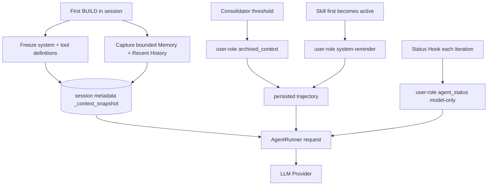

# KV 缓存友好上下文架构设计与验证报告

验证日期：2026-08-02。

## 结论

RepoOps 已经按“静态前缀冻结、动态信息留在轨迹、接近阈值才批量压缩”的原则完成
代码级实现，不再把 Memory、Recent History、Archived Summary 或 Active Skill 每轮
重建进 System Prompt。

当前请求结构是：

```text
system                              会话内字节冻结
tools                               会话内 schema 冻结
user-role memory snapshot           有界、会话内冻结
user-role recent-history snapshot   有界、会话内冻结
user / assistant / tool             正常持久轨迹
user-role archived context          达到压缩边界时追加
user-role active skill              首次生效时追加一次
user-role agent status              每次模型调用临时追加
```

这不意味着“压缩完全不影响 KV Cache”。在归档边界替换旧 replay 时，边界之后需要重新
计算；实现目标是把失效限制在局部，而不是因为每轮修改 system 导致整个 system 后缀
持续失效。

## 数据流



## 1. 静态 System Prompt 与工具定义

`ContextBuilder.build_system_prompt()` 现在只装配：

- Runtime/Workspace identity；
- `AGENTS.md`、`SOUL.md`、`USER.md` 等 bootstrap 文件；
- 固定工具契约；
- 最多 2,000 token 的 Skill 索引，不包含 Active Skill 正文。

第一次 BUILD 调用 `ensure_session_context_snapshot()`，把以下字段保存到
`Session.metadata._context_snapshot`：

```text
version
system_prompt
system_sha256
memory_snapshot
memory_sha256
recent_history_snapshot
recent_history_sha256
tool_definitions
tools_sha256
```

读取时会重新计算四组 hash；损坏或被篡改的快照会重建，并清除基于旧前缀的 resumable
Provider state，强制完成一次一致的全量 replay。后续轮次直接读取有效快照。即使会话过程中修改 `AGENTS.md`、`MEMORY.md`、Recent
History 或 ToolRegistry，当前会话发送的 system 和 tools 仍保持不变。`AgentRunner`
在请求和 token 估算中都使用冻结 definitions，避免“估算按旧工具、发送按新工具”。

`/new` 会清除快照；fork 作为新会话重新生成快照。工具执行仍从活动 registry 查找，
因此工具拓扑改变后应新建会话，不应让旧 schema 指向已经移除的执行器。

## 2. Memory 与 Recent History

Memory 和 Recent History 不再进入 System Prompt，而是被包装成：

```xml
<memory_snapshot frozen_for_session="true">...</memory_snapshot>
<recent_history_snapshot frozen_for_session="true">...</recent_history_snapshot>
```

二者都是 `role=user`、`context_meta.isMeta=true` 的框架元消息：

| 内容 | 上限 | 更新时机 |
|---|---:|---|
| `MEMORY.md` 快照 | 2,000 token | 新会话第一次 BUILD |
| 尚未 Dream 的 Recent History | 8,000 token、最多 50 条 | 新会话第一次 BUILD |

Dream 在当前会话运行后不会回写该快照；新记忆从下一个会话开始生效。需要详细长期
记忆时，通用只读 `read_file` 已允许读取 `memory/MEMORY.md`，而不是把全部记忆永久
塞入上下文。Dream 自己的 `dream:*` 临时会话不加载 RepoOps always-on Skill，只处理
`build_dream_prompt()` 选中的有界批次。

## 3. Consolidator 与 Archived Context

Consolidator 仍然只在 replay 消息数或 token 阈值触发时工作，不做每轮摘要。归档成功
后会：

1. 生成摘要和稳定的 SHA-256 短 ID；
2. 在 `last_consolidated` replay 边界插入 UI 隐藏的 user-role 消息；
3. 内容使用 `<archived_context id="...">` 包装；
4. 推进 `last_consolidated`，使旧前缀不再进入正常模型 replay；
5. 保留原始 append-only `history.jsonl`，便于审计和故障恢复；
6. 清除旧 Provider state，避免恢复一个与新 replay 不一致的远端状态。

归档 metadata ledger 最多保留 8 条或 8,000 token，只有跨阈值时才裁剪。模型轨迹中
已有归档消息时不会再从 ledger 重复注入；全是 Archive 的边界也不会反复摘要形成死
循环。

## 4. Active Skill 元消息

always-on Skill 和用户显式 `$skill` 首次生效时，以以下形式追加在当前轨迹末尾：

```xml
<system-reminder>
The following framework-provided skill applies from this point onward...
### Skill: repoops
...
</system-reminder>
```

消息使用 `role=user`，带 `context_meta.kind=active_skills`，并以 `_hidden_history` 标记为
UI 不可见。Skill 名称记录到 `_loaded_skill_snapshots`；下一轮从 metadata 和已持久历史
双重恢复，fork 复制了 Skill 消息时也不会再次追加。

因此 Skill 正文只在首次生效位置造成一次局部前缀变化，后续请求继续 append，不会每轮
修改 System Prompt。Provider 最终可能剥离内部 `_meta` 字段，但 wire 上仍保留
user role 和 `<system-reminder>` 内容。

## 5. Agent Status Bar

`RepoOpsStatusHook.before_iteration()` 在上下文治理完成后，把当前状态追加到
`model_messages` 副本：

```json
{
  "role": "user",
  "content": "<agent_status>...</agent_status>",
  "_meta": {
    "context_meta": {
      "isMeta": true,
      "kind": "agent_status",
      "persistence": "model_only"
    }
  }
}
```

它不写入 session、checkpoint 或 trajectory。动态状态仍会使其自身位置之后无法复用
旧缓存，这是为了把 iteration、预算、重复指纹、证据进度和审批状态放在生成位置附近
所做的明确取舍；静态 system/tools 和此前轨迹不会因此被重建。

对于 OpenAI Responses 等可恢复 Provider state，第一次恢复请求会把 Active Skill 和
Status 作为 supplemental messages 一并传入，避免远端 state 恢复时漏掉本地元消息。

## 6. 大工具输出 Artifact Offloading

超过 `maxToolResultChars` 的结果不会只返回一个不可追踪的截断字符串。完整内容原子写入：

```text
<workspace>/.nanobot/tool-results/<session>/<tool-call>.txt
```

模型收到：

- `artifact://tool-results/...` URI；
- 绝对保存路径；
- UTF-8 字节数；
- 完整内容 SHA-256；
- 头部和尾部预览，中间明确标记省略。

通用 profile 用 `read_file` 回读；RepoOps 新增第 16 个工具
`repoops_read_artifact`，只允许读取 `.nanobot/tool-results` 内的文件，支持 URI/路径和
有界行范围。目录穿越、目录读取、超大文件和超过 1,000 行的请求会失败。若受限 profile
没有任何 Artifact reader，则保持有界内联结果，避免返回模型无法读取的假 URI。

## 7. Token 预算下的退化顺序

旧 `snip_history` 从末尾倒序保留消息。Active Skill 也是 user role 且位于末尾，在很小
窗口里可能出现“Skill 被保留，真正问题被裁掉”。现在 ContextGovernor 读取
`context_meta.isMeta`，退化顺序改为：

1. 找到最新的非元消息 user；
2. 无条件保留该真实 user 及其当前 assistant/tool 链；
3. 按剩余预算加入该轮 Skill/Archive 等元消息；
4. 最后从近到远加入旧历史；
5. 再做合法 tool-call/result 配对修复。

因此预算不足时可以丢弃过大的 Skill 正文，但不会只把 Skill 当作用户问题发送。工具
输出先经过 Artifact offload 和 in-flight micro-compaction，降低当前工具链本身超限的
概率。

## 自动化验证

关键用例包括：

| 不变量 | 测试证据 |
|---|---|
| System/Memory/History/tools 会话内冻结 | `test_session_snapshot_freezes_system_memory_history_and_tools` |
| Snapshot/Archive 是 user-role meta | `test_snapshot_and_archive_are_user_role_meta_messages` |
| 多轮请求前缀稳定、Skill 只落盘一次 | `test_runtime_context_is_persisted_as_next_turn_prompt_prefix` |
| Consolidator 在 replay 边界保留 Archive | `tests/agent/test_consolidator.py` 的 replay/token 边界组 |
| Resumable Provider 收到动态元消息 | `test_runner_sends_ephemeral_meta_to_resumable_provider_state` |
| Runner 使用冻结工具定义 | `test_runner_uses_session_frozen_tool_definitions` |
| 元消息不能挤掉真实用户问题 | `test_snip_history_never_lets_trailing_meta_displace_real_user` |
| 大输出包含 URI/hash/预览 | `test_runner_persists_large_tool_results_for_follow_up_calls` |
| RepoOps Artifact URI 可读且拒绝逃逸 | `test_read_artifact_supports_uri_and_rejects_escape` |
| Status 为 model-only 元消息 | `test_status_is_ephemeral_and_reports_task_budget_repeat_and_approval` |

本次 Agent + RepoOps 完整专项回归结果：`1553 passed, 2 skipped, 0 failed`。Ruff 与严格
BasedPyright 在相关代码上通过。最终全仓库测试结果以
[项目评估报告](项目评估报告.md)中的工程验证表为准。

## 尚未证明的内容

1. 当前验证证明的是消息位置、生命周期、hash、裁剪优先级和持久化边界；没有伪造
   DeepSeek/Anthropic 的真实 cache hit 指标。
2. 首次请求仍需支付 System、tools 和有界 Memory 的 prefill 成本；“缓存友好”不是
   首次 token 免费。
3. Archive 边界发生变化时，边界之后仍需重新计算；这是用局部 cache miss 换取更短
   上下文的设计。
4. 不同 Provider 的缓存粒度和计费口径不同。要量化收益，需要固定模型与任务，对比
   cache creation/read tokens、首 token 延迟、总输入 token 和压缩次数。
5. 当前 Artifact 是本地工作区能力，不是跨机器对象存储；清理 workspace 后 URI 失效。

因此面试时准确表述应是：

> 我实现了会话级静态前缀和工具 schema 冻结，把 Memory、Recent History、Archive、
> Skill、Status 分层成 user-role 元消息；Consolidator 只在阈值批量归档，大输出落盘
> 并用 hash/URI 回读，裁剪时优先保护真实用户输入。自动化测试验证了消息和持久化
> 不变量，但真实 Provider 的 cache hit/延迟收益仍需单独做线上消融。
