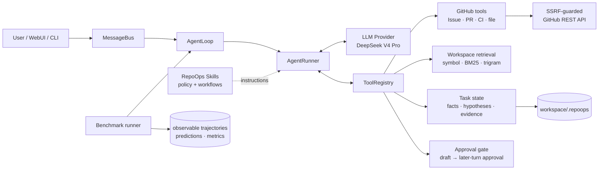
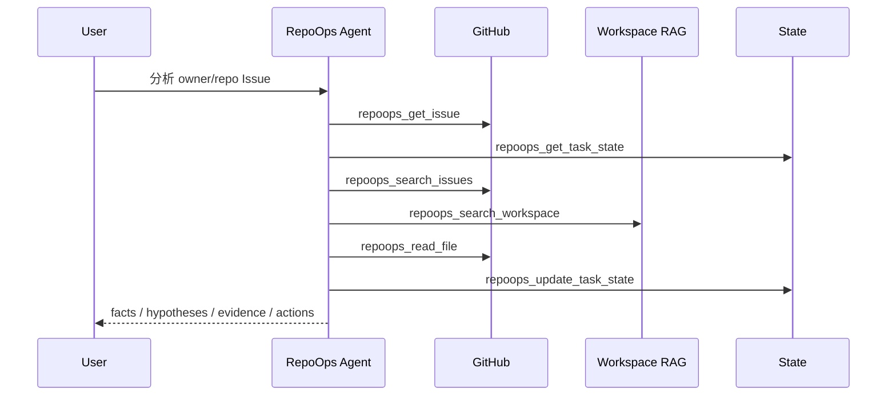
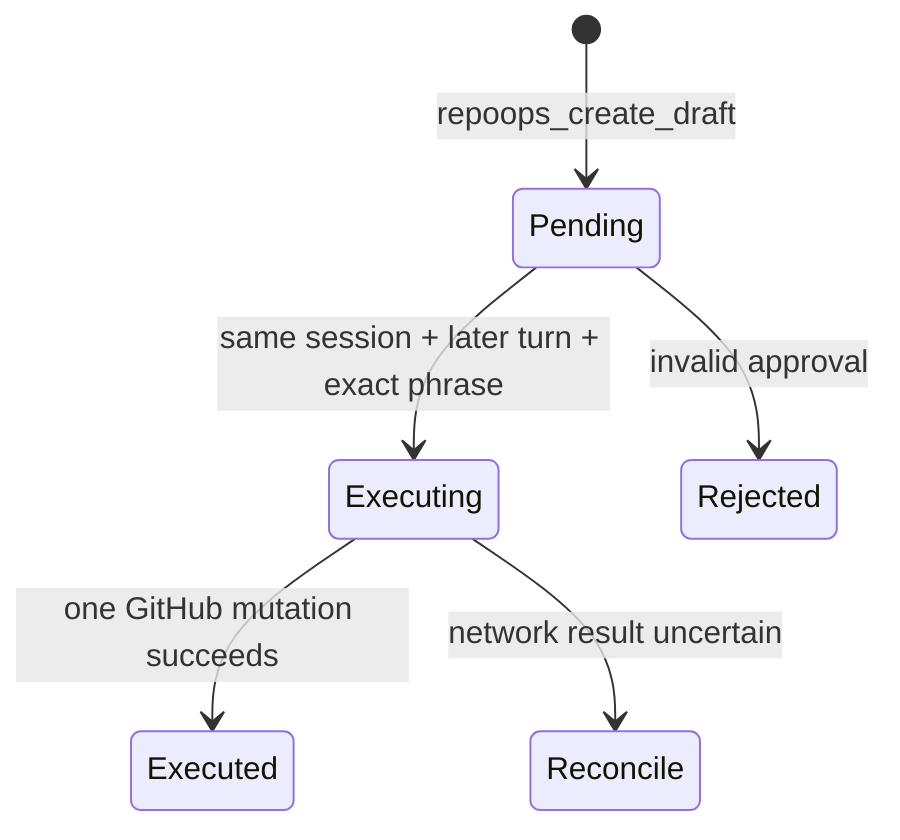

# RepoOps Architecture

RepoOps 没有把一段仓库分析 prompt 包装成产品。它复用 nanobot 的小型 Agent
runtime，在运行时边界增加 15 个 GitHub/代码工具、结构化状态、安全策略和可复现
评测。



## 一次 Issue 分析



模型负责选择工具和综合结论；工具负责权限、网络、参数和状态边界。Issue、PR、
代码和日志一律视为不可信数据，不能变成系统指令或批准。

## 模块

| 模块 | 职责 |
|---|---|
| `nanobot/agent/tools/repoops.py` | 15 个 Agent 工具及 JSON schema |
| `nanobot/repoops/client.py` | GitHub REST、SSRF、Actions 日志跳转和大小限制 |
| `nanobot/repoops/models.py` | 任务、证据、假设、工具记录和草稿模型 |
| `nanobot/repoops/state.py` | 工作区内原子状态持久化 |
| `nanobot/repoops/safety.py` | 仓库 allowlist 与两回合审批 |
| `nanobot/repoops/retrieval.py` | Python 符号分块、BM25、trigram 和精确符号重排 |
| `nanobot/repoops/benchmark.py` | 启动真实 Agent、隔离会话并保存可观察轨迹 |
| `nanobot/repoops/evaluation.py` | 预测 schema 与 10 项指标 |
| `nanobot/repoops/benchmark_merge.py` | 合并并行 benchmark shards |
| `nanobot/skills/repoops*` | 总体策略和 Issue/PR/CI 工作流 |

## Skill 与 Agent 的边界

Skill 是注入 Agent 上下文的工作流说明；它不新增工具权限、不持久化状态，也不能
在模型之外强制安全门。RepoOps Skill 只规定“先取什么证据、如何区分事实与假设”。
真正使本项目成为 Agent 系统的是：

- `AgentRunner` 的模型—工具循环；
- 可执行且有 schema 的 RepoOps 工具；
- GitHub allowlist、SSRF 和两回合审批；
- 跨轮任务状态与证据模型；
- 使用真实模型产生轨迹的 benchmark harness。

因此删掉四个 RepoOps Skill 后，工具和安全机制仍然存在，只是模型少了领域流程
指导；只复制 Skill 到另一个 nanobot，则不会凭空获得这些工具和状态实现。

## 状态与一致性

每个任务默认存储于：

```text
<workspace>/.repoops/tasks/<owner>__<repo>/<task-type>-<number>.json
```

`confirmed_facts`、`hypotheses` 和 `evidence` 分开保存。假设带置信度、证据 ID 和
证伪方式，避免上下文压缩后把推测升级成事实。写入使用临时文件、`fsync` 和原子
替换。benchmark 每次 invocation 生成唯一 session namespace 和
`.repoops/benchmark/<id>` state directory，防止历史答案污染下一次测量；顶层
`.repoops` 被 workspace indexer 排除，因此评测状态不会参与后续代码检索。

## 检索

本地工作区按 Python 顶层函数/类分块，其他文本使用重叠行窗口。候选分数为：

```text
BM25 lexical score + 2 × trigram similarity + exact-symbol/path boost
```

这是离线、确定性的轻量实现，不声称等同于 dense embedding 或 cross-encoder。
远程源码不会默认上传到 embedding 服务。

## 写安全状态机



同轮批准、其他会话批准、模糊同意、Issue/PR/CI 内容里的批准文字都会被拒绝。
网络结果不确定时不会自动重试高风险写入，避免重复评论或重复合并。
