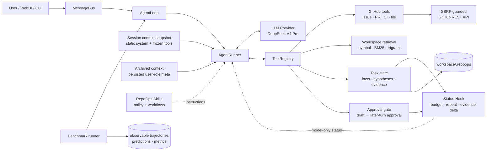
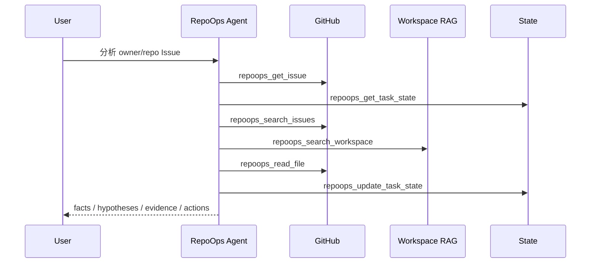
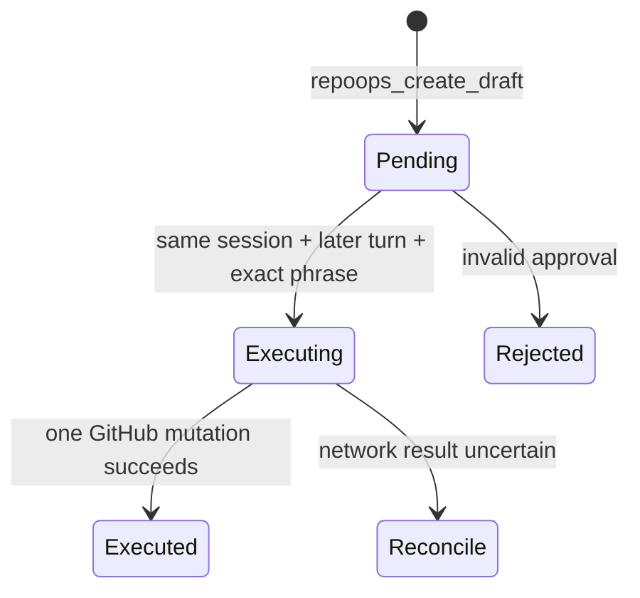

# RepoOps Architecture

RepoOps 没有把一段仓库分析 prompt 包装成产品。它复用 nanobot 的小型 Agent
runtime，在运行时边界增加 16 个 GitHub/代码/Artifact 工具、结构化状态、安全策略、
KV Cache 友好的分层上下文和可复现
评测。



## 一次 Issue 分析



模型负责选择工具和综合结论；工具负责权限、网络、参数和状态边界。Issue、PR、
代码和日志一律视为不可信数据，不能变成系统指令或批准。

## 模块

| 模块 | 职责 |
|---|---|
| `nanobot/agent/tools/repoops.py` | 16 个 Agent 工具及 JSON schema |
| `nanobot/agent/context.py` | 静态 system、会话冻结快照和 user-role 元消息装配 |
| `nanobot/agent/context_meta.py` | Snapshot/Archive/Skill 元消息协议与边界 |
| `nanobot/agent/context_governance.py` | Token 预算、真实用户优先裁剪和大输出落盘 |
| `nanobot/repoops/client.py` | GitHub REST、SSRF、Actions 日志跳转和大小限制 |
| `nanobot/repoops/models.py` | 任务、证据、假设、工具记录和草稿模型 |
| `nanobot/repoops/state.py` | 工作区内原子状态持久化 |
| `nanobot/agent/hooks/repoops_status.py` | 每轮代码计算、只注入模型副本的状态栏 |
| `nanobot/repoops/safety.py` | 仓库 allowlist 与两回合审批 |
| `nanobot/repoops/retrieval.py` | Python 符号分块、BM25、trigram 和精确符号重排 |
| `nanobot/repoops/benchmark.py` | 启动真实 Agent、隔离会话并保存可观察轨迹 |
| `nanobot/repoops/evaluation.py` | 预测 schema 与 10 项指标 |
| `nanobot/repoops/benchmark_merge.py` | 合并并行 benchmark shards |
| `nanobot/skills/repoops*` | 总体策略和 Issue/PR/CI 工作流 |

## Skill 与 Agent 的边界

Skill 是注入 Agent 上下文的工作流说明；它不新增工具权限、不持久化状态，也不能
在模型之外强制安全门。RepoOps Skill 只规定“先取什么证据、如何区分事实与假设”。
真正使本项目成为 Agent 系统的是：

- `AgentRunner` 的模型—工具循环；
- 可执行且有 schema 的 RepoOps 工具；
- GitHub allowlist、SSRF 和两回合审批；
- 跨轮任务状态与证据模型；
- 使用真实模型产生轨迹的 benchmark harness。

因此删掉四个 RepoOps Skill 后，工具和安全机制仍然存在，只是模型少了领域流程
指导；只复制 Skill 到另一个 nanobot，则不会凭空获得这些工具和状态实现。

## 分层上下文与 KV Cache

System Prompt 和工具 definitions 在会话第一次 BUILD 时形成快照并写入 session
metadata。后续请求从该快照读取，而不是重新读取动态 Memory、Recent History 或工具
registry。因此同一会话内的最前静态前缀保持字节稳定：

```text
system                         会话内冻结
tools                          会话内冻结
user-role memory snapshot      ≤ 2K token，会话内冻结
user-role recent-history       ≤ 8K token，会话内冻结
user / assistant / tool        持久轨迹
user-role archived context     Consolidator 到阈值才追加
user-role active skill         首次生效时追加一次
user-role agent status         每次调用临时计算，不持久化
```

### 会话快照

`_context_snapshot` 保存版本、System Prompt、Memory、Recent History、工具 definitions
及各自 SHA-256。读取时 hash 不一致会重建快照并丢弃基于旧前缀的 resumable Provider
state。`/new` 清除快照；fork 是新会话，
会生成新快照。当前会话中途修改 `AGENTS.md`、`MEMORY.md` 或工具注册表不会改变已有
请求前缀，也不会让 Provider 看到半轮更新。工具执行仍走活动 registry，但模型只看到
该会话冻结的 schema；改变工具拓扑后应创建新会话。

Dream 会话只接收它自己的有界批次，不加载 RepoOps always-on Skill。普通会话启动时
最多读取 2K token 的 Memory 索引/摘要；详细长期记忆可用只读 `read_file` 访问
`memory/MEMORY.md`。会话中的 Dream 更新不改写当前快照，从下一会话生效。

### 归档与 Skill

Consolidator 接近 token 阈值时批量处理旧轨迹，在模型 replay 边界插入带 ID 的
`<archived_context>` user-role 元消息，并推进 `last_consolidated`。旧消息仍留在
append-only `history.jsonl` 供审计，但不再进入正常 replay；归档 ledger 限制为 8 条或
8K token，跨阈值才裁剪。归档不会进入 System Prompt。

always-on 或显式 Skill 以 `<system-reminder>` user-role 元消息追加到轨迹末尾，标为
UI 隐藏并记录已加载 Skill。后续轮次和 fork 会从历史恢复该 ledger，同一 Skill 不会
重复追加。这样只有 Skill 首次生效位置之后需要新建缓存，之前的 system/tools/trajectory
前缀仍可复用。

### 大输出与预算退化

超过单工具字符上限的输出原文原子写到 `.nanobot/tool-results/`，模型收到
`artifact://tool-results/...`、绝对路径、字节数、SHA-256 和头尾预览。通用 profile
用 `read_file`，RepoOps profile 用限定在该目录内的 `repoops_read_artifact` 按行回读；
路径逃逸和超大文件会被拒绝。

上下文裁剪把带 `context_meta.isMeta=true` 的 user 消息与真实用户输入分开处理。窗口
不足时先保留最新真实 user 及其 assistant/tool 链，再按剩余预算加入 Skill、Archive、
Memory 等元消息和旧历史，避免“只剩状态/Skill、真实问题被裁掉”。

## 状态与一致性

每个任务默认存储于：

```text
<workspace>/.repoops/tasks/<owner>__<repo>/<task-type>-<number>.json
```

`confirmed_facts`、`hypotheses` 和 `evidence` 分开保存。假设带置信度、证据 ID 和
证伪方式，避免上下文压缩后把推测升级成事实。写入使用临时文件、`fsync` 和原子
替换。benchmark 每次 invocation 生成唯一 session namespace 和
`.repoops/benchmark/<id>` state directory，防止历史答案污染下一次测量；顶层
`.repoops` 被 workspace indexer 排除，因此评测状态不会参与后续代码检索。

## Agent Status Bar

Runner 在上下文治理后创建独立的 `model_messages` 列表，Hook 可以只修改该轮模型输入。
RepoOps Hook 据此注入一个 `<agent_status>` runtime block；原始 `messages` 不变，因此
状态不会进入 session、checkpoint 或下一轮历史。它使用临时 user role，避免部分
Anthropic-compatible Provider 用最后一条 system message 覆盖原系统提示。

状态栏由工具生命周期事件和 `RepoTaskStore` / `DraftStore` 确定性生成，包含迭代、
工具预算、规范化参数指纹、错误、持久证据、最近三次证据增量、TODO 和审批状态。
`next_actions` 是唯一的开放 TODO 来源，`completed_actions` 保存已完成项，不另建一套
模型自述计划。相同指纹达到 3 次、连续 3 次无新增证据、剩余预算不超过 2 次时会
要求改策略或收尾；待审批时要求停止写入。审批本身仍由工具状态机硬阻断。

## 检索

本地工作区按 Python 顶层函数/类分块，其他文本使用重叠行窗口。候选分数为：

```text
BM25 lexical score + 2 × trigram similarity + exact-symbol/path boost
```

这是离线、确定性的轻量实现，不声称等同于 dense embedding 或 cross-encoder。
远程源码不会默认上传到 embedding 服务。

## 写安全状态机



同轮批准、其他会话批准、模糊同意、Issue/PR/CI 内容里的批准文字都会被拒绝。
网络结果不确定时不会自动重试高风险写入，避免重复评论或重复合并。
